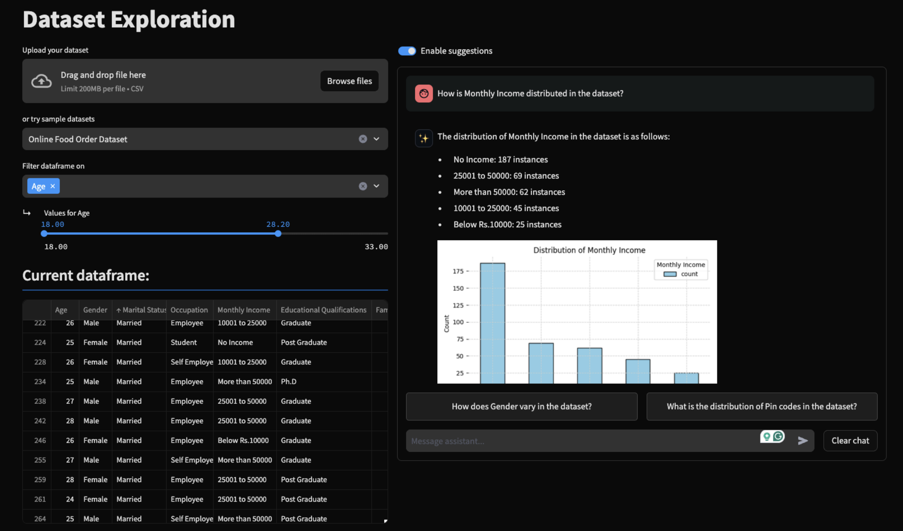

# Data Exploration Assitant

## Overview
The Data Exploration Assistant is a web-based application designed to facilitate easy and intuitive data exploration using natural language. Users can upload datasets, view data in a structured table format, and interact directly with the dataset through conversational queries powered by OpenAI's GPT-4 and the LangChain framework. This allows users to analyze and visualize data with simple English prompts, enhancing accessibility and usability across various user skill levels.

  

## Features
- **Dataset Upload**: Users can easily upload their datasets to the platform.
- **Data Viewing**: Uploaded datasets can be viewed in a table format, allowing for easy data navigation.
- **Conversational Data Queries**: Utilizes GPT-4 and LangChain to enable users to ask questions and request data analysis through plain English prompts.
- **Chart Generation**: Leverages the LIDA library to dynamically generate charts based on user requests, facilitating visual data exploration.
- **Analysis Suggestions**: Offers suggestions for further data analysis based on the current dataset and user interactions, aiding in deeper data understanding.

## Project Structure and Technologies
The application is built using the Streamlit framework. The backend is written in Python, with integration of the OpenAI API for processing natural language queries and generating responses.

### Core Components:
- **Streamlit**: Provides the web framework for rapid development of data applications.
- **OpenAI API (GPT-4)**: Powers the conversational interface, enabling the tool to understand and respond to user queries in natural language.
- **LangChain**: Facilitates the linkage between conversational AI and practical data operations within the tool.
- **LIDA**: Utilized for the generation of dynamic charts based on textual descriptions of the desired visualizations.